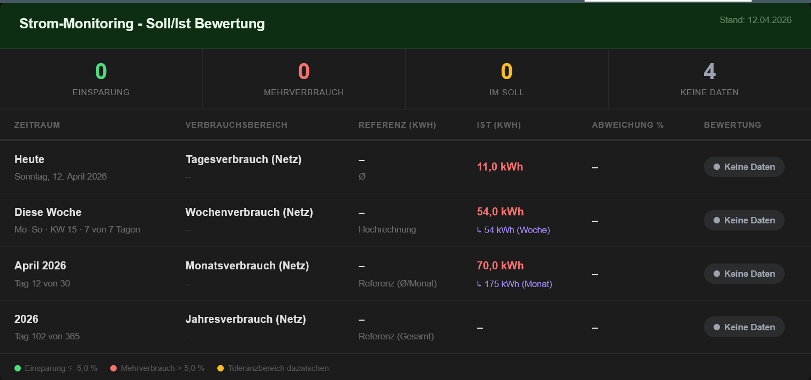
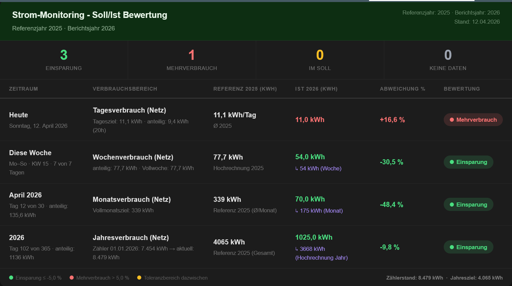

# Energie-Monitoring-Card

Eine Home-Assistant-Karte fuer ein schrittweises Energie-Monitoring.

Aktueller Fokus:
1. Strom-Basis (Hausstrom) einfach und laienfreundlich
2. Strom-Erweiterungen mit PV/BKW/Speicher
3. Optionale Module fuer Kosten und Amortisation

Geplante Erweiterung:
1. Gas
2. Wasser
## Installation

### HACS (empfohlen)
1. HACS -> Frontend -> Benutzerdefiniertes Repository hinzufuegen
2. Repository-URL: `https://github.com/TyceTV/strom-monitoring-card`
3. Typ: `Dashboard`
4. Installieren
5. Browser hart neu laden (`Strg+F5`)

Die Ressource wird normalerweise automatisch angelegt als:
- `/hacsfiles/strom-monitoring-card/strom-monitoring-card.js`

### Manuell
1. `strom-monitoring-card.js` nach `/config/www/` kopieren
2. `Einstellungen -> Dashboards -> Ressourcen -> Ressource hinzufuegen`
3. URL: `/local/strom-monitoring-card.js`
4. Typ: `JavaScript-Modul`
5. Browser hart neu laden (`Strg+F5`)

## Schnellstart

### 1) Technisch minimal

```yaml
type: custom:strom-monitoring-card
entity_grid_total_kwh: sensor.grid_energy_total
```

Beispielansicht (Minimal-Konfiguration):



Was du bekommst:
- Live-Istwerte (Tag/Woche/Monat)
- technische Funktionspruefung der Karte
- fuer sinnvolle Bewertung mindestens `year_start_meter_kwh` setzen

### 2) Empfohlen (fuer sinnvolles Monitoring mit Auto-Berechnung)

```yaml
type: custom:strom-monitoring-card
entity_grid_total_kwh: sensor.stromzahler_verbrauch

report_year: "2026"
reference_year: "2025"
year_start_meter_kwh: 7454

targets:
  year_kwh: 3500
reference:
  year_kwh: 4065
```
Beispielansicht (Empfohlen-Konfiguration):




Was du bekommst:
- Istwerte + Bewertung (Einsparung/Mehrverbrauch)
- Zielwerte werden automatisch aus Jahresfortschritt berechnet (wenn `targets` fehlen)
- Referenz wird automatisch aus `reference_year` abgeleitet oder auf Ziele gespiegelt (Auto-Referenz)
- Jahreswerte aus Zaehlerstand ab Jahresbeginn

## Woher kommen die Werte?

### Pflicht
- `entity_grid_total_kwh`
  - dein kumulativer Netzbezugszaehler in kWh
  - muss ein ansteigender Gesamtzaehler sein

### Jahresbasis
- `year_start_meter_kwh`
  - Zaehlerstand am 01.01. des Berichtsjahres
  - Beispiel: Wenn am 01.01. der Zaehler 7454 kWh hatte -> `7454`

### Jahre
- `report_year`
  - Jahr der aktuellen Beobachtung (z. B. `"2026"`)
- `reference_year`
  - Vergleichsjahr (z. B. `"2025"`)

### Ziele (`targets`)
- `targets` sind optional.
- Wenn gesetzt, nutzt die Karte exakt diese Werte.
- Empfohlen: nur `targets.year_kwh` setzen.
- Bedeutung: Das ist dein Jahresziel, also der Verbrauch, den du im laufenden Jahr erreichen willst.
- Wenn nicht gesetzt, berechnet die Karte automatisch:
  - `targets.year_kwh = (aktueller_zaehler - year_start_meter_kwh) / vergangene_tage * tage_im_jahr`
  - `targets.month_kwh = targets.year_kwh / 12`
  - `targets.day_kwh = targets.year_kwh / tage_im_jahr`
- `targets.day_kwh` und `targets.month_kwh` sind optional fuer Feintuning.

### Referenz (`reference`)
- `reference` ist optional.
- Wenn gesetzt, nutzt die Karte exakt diese Werte.
- Empfohlen: nur `reference.year_kwh` setzen.
- Bedeutung: Das ist dein Vorjahresverbrauch (z. B. aus der Stromrechnung), gegen den verglichen wird.
- Wenn nicht gesetzt:
  - mit `reference_year`: automatische Referenz aus Vorjahresverbrauch
  - ohne verwertbare Vorjahresdaten: Fallback auf `targets` (Hinweis als Plausibilitaetswarnung: Auto-Referenz aktiv)

## Vollkonfiguration (optional)

```yaml
type: custom:strom-monitoring-card

entity_grid_total_kwh: sensor.stromzahler_verbrauch
entity_solar_today_kwh: sensor.pv_generation_today
entity_solar_total_kwh: sensor.pv_generation_total
entity_solar_export_kwh: sensor.stromzahler_erzeugung

report_year: "2026"
reference_year: "2025"
year_start_meter_kwh: 7454
year_days_mode: auto

targets:
  year_kwh: 3500
reference:
  year_kwh: 4065

thresholds:
  mode: symmetric
  good_pct: -5
  warn_pct: 5

tariff:
  energy_ct_per_kwh_net: 27.965
  base_eur_per_year_net: 75.60
  metering_eur_per_year_net: 18.92
  vat_pct: 19
billing:
  reference_cost_brutto_eur: 1465.25
  monthly_advance_brutto_eur: 135.00

bkw:
  enabled: true
  start_date: "2025-10-01"
  investment_eur: 1099.99
  nominal_kwp: 1.72
  battery_kwh: 2.048
  feed_in_limit_w: 800

amortization:
  value_mode: gross_tariff
  custom_eur_per_kwh: 0.34

ui:
  title: "Strom-Monitoring"
  subtitle: "Referenzjahr 2025 · Berichtsjahr 2026"
  locale: de-DE
  currency: EUR
  update_interval_sec: 120
  show_warnings: true
  show_sections:
    table: true
    bkw: true
    costs: true
    amortization: true
```

## Wichtige Felder (Kurzueberblick)

- `thresholds.good_pct`: ab welcher negativen Abweichung als Einsparung gilt
- `thresholds.warn_pct`: ab welcher positiven Abweichung als Mehrverbrauch gilt
- `tariff.*`: Tarifdaten fuer Kostenrechnung
- `billing.*`: Referenzkosten/Abschlag
- `bkw.*`: Balkonkraftwerk-Basisdaten
- `ui.show_sections.*`: einzelne Bloecke ein-/ausblenden

## Typische Probleme

### "Custom element doesn't exist: strom-monitoring-card"
- Ressource fehlt/falscher Pfad/falscher Typ
- Loesung:
  1. Ressourcen pruefen
  2. Typ muss `JavaScript-Modul` sein
  3. `Strg+F5`

### Referenz bleibt leer (`-`)
- `reference.*` nicht gesetzt und keine automatische Ableitung moeglich
- fuer Auto-Referenz mindestens `year_start_meter_kwh` setzen

### Jahreswert bleibt leer
- `year_start_meter_kwh` fehlt oder ist ungueltig

### Einzug soll nicht sichtbar sein
- `einzug_datum` nicht setzen

## Legacy-Mapping (alt -> neu)

- `entity` -> `entity_grid_total_kwh`
- `entity_solar_today` -> `entity_solar_today_kwh`
- `entity_solar_total` -> `entity_solar_total_kwh`
- `entity_solar_export` -> `entity_solar_export_kwh`
- `berichtsjahr` -> `report_year`
- `referenzjahr` -> `reference_year`
- `jahres_start_kwh` -> `year_start_meter_kwh`
- `tagesziel` -> `targets.day_kwh`
- `monatsziel` -> `targets.month_kwh`
- `jahresziel` -> `targets.year_kwh`
- `ref_tag` -> `reference.day_kwh`
- `ref_mon` -> `reference.month_kwh`
- `ref_jahr` -> `reference.year_kwh`

## Lizenz

MIT

## Changelog

Siehe [CHANGELOG.md](./CHANGELOG.md)

## Mini-Glossar

- `kWh`: Kilowattstunde (Energieverbrauch/-erzeugung)
- `ct/kWh`: Cent pro Kilowattstunde (Arbeitspreis)

